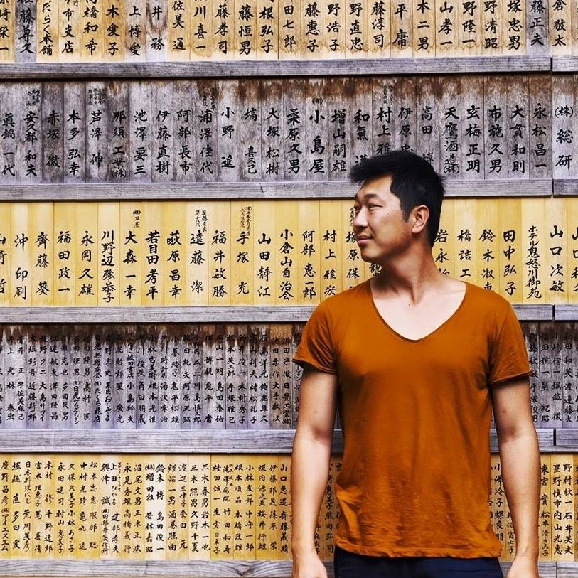

	
	<h1 class="mt-5 mb-2">Hi, I'm Weiqiang</h1>
	

		Project manager
		Full-stack developer
		Software architect
		Business analyst
	

	
	

		

			

				Or just call me <em>Wei</em>. Currently contracting for a bank in <em>Zurich, Switzerland</em> as a project manager in  digital transformation and digital channels.
			

			

				I am also the <em>Head of Technology</em> <a href="https://www.ediqo.com" target="_blank">@Ediqo</a>, a global service that helps non-native English speaking researchers getting their academic research published.
			

			

				I have over 10 years working experience with <a href="https://www.avaloq.com" target="_blank">Avaloq</a>, as a Software Engineer, Software Architect and Project Manager. Avaloq is a leading banking system from a Swiss unicorn FinTech of the same name.
			

			

				I'm a <em>full-stack developer</em>, proficient in <em>Javascript, CSS, HTML, PHP, etc</em>. Currently learning <a href="https://vuejs.org/" target="_blank">Vue.js</a>. Implemented numerous websites and side-projects for fun.
			

			

				Travelling is my passion. Follow me on instagram to see some photos of my travels. Feel free to send me an email if you want to be in touch.
			

		

	

